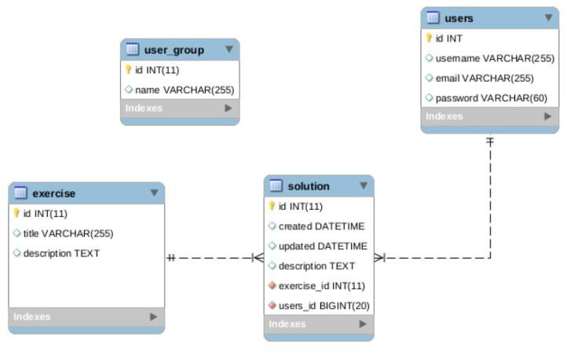

# Academy_APP

The aim of this project is to write object-oriented, database layer of the application for the school academy.

### Purpose of the APP

* integrate database with OOP model
* work with MySQL db
* DriverManager connection
* Active Record Design Pattern
* CRUD methods
* Blowfish BCrypt to hash password

### Communication

This is console application, with Admin and User panel.

Admin:
    
    * add / update / delete - users / groups / exercises / solution
User:
    
    * add / view - exercise solution

### JBCrypt

### Data Access Object Pattern

### Entities - DATA SCHEMA

* USER
* GROUP
* EXERCISE
* SOLUTION

